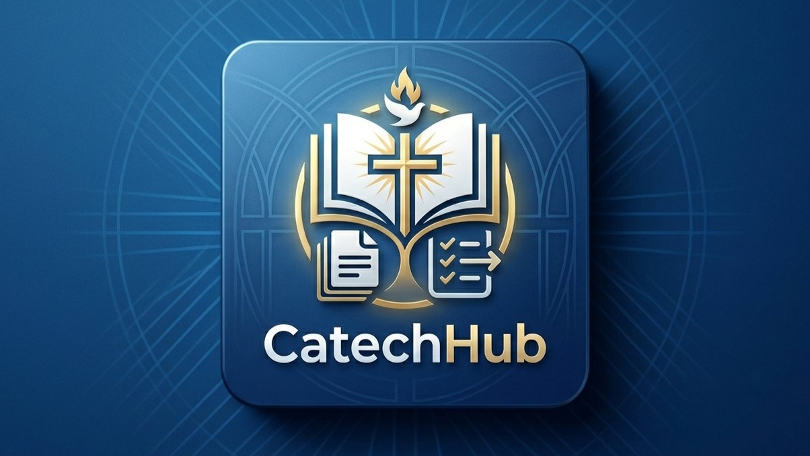

# CatechHub



## Registro elettronico di catechismo — offline, sicuro, peer-to-peer

<p align="center">
  
  <a href="https://github.com/delelimed/CatechHub/actions/workflows/android-build.yml"></a>
  
  
  
  
  
  
  
  
</p>

---

CatechHub è un'applicazione mobile creata **da un catechista per i catechisti**. Digitalizza il registro parrocchiale in modo completo, sicuro e rispettoso della privacy dei minori. Tutti i dati restano sul tuo dispositivo, protetti da crittografia AES-256-GCM. Nessun cloud, nessun server centrale, nessuna connessione internet necessaria.

## Perché CatechHub?

| Problema | Soluzione CatechHub |
| --- | --- |
| Fogli di carta persi o illeggibili | Anagrafica digitale con ricerca immediata |
| Dati sensibili di minori su cloud (o su fogli accessibili a tutti...) | **Zero dati su server esterni** — tutto rimane sul dispositivo |
| App che richiedono internet | **100% offline** — funziona anche in montagna o nelle sale più schermate |
| Condivisione complicata tra catechisti | **Sync P2P via Bluetooth/WiFi Direct** — crittografato end-to-end |
| Privacy sacrificata per la comodità | **Privacy by design** — biometria, schermo protetto, dati cifrati |

## Sicurezza — Difesa a Strati

CatechHub adotta un approccio **defense-in-depth**, dove ogni livello è progettato per proteggere i dati anche se quello precedente venisse superato:

| Cosa protegge | Come lo fa |
| --- | --- |
| **Accesso all'app** | Solo con impronta digitale / riconoscimento facciale / PIN del telefono — nessuna password personalizzata, nessun account |
| **Blocco hardware** | Verifica TEE/StrongBox all'avvio — se hardware di sicurezza assente, l'app NON si avvia (nessun fallback software) |
| **Dati sul telefono** | Cifrati con **AES-256-GCM** — chiave master custodita in **AndroidKeyStore** (TEE/StrongBox hardware, nessun fallback software) |
| **Sincronizzazione P2P BT/WiFi** | End-to-end encryption con **X25519 ECDH + HKDF + AES-256-GCM** — chiavi di dispositivo per associazione, chiavi effimere per sessione (forward secrecy), pairing code a 6 cifre anti-MitM, key pinning sulle riconnessioni, **doppio consenso** per dispositivi "Altro Catechista" |
| **Condivisione QR** | Cifratura AES-256-GCM con PIN a 8 cifre (valido 3 minuti), checksum SHA-256 per chunk, chunking automatico, sync differenziale |
| **Schermo** | Blocco screenshot e screen recording non autorizzati con FLAG_SECURE |
| **Runtime** | freeRASP rileva e blocca root, emulatori, tampering e hacking |
| **Sessione** | Blocco automatico dopo 2 minuti in background, stato solo in RAM |
| **Backup** | Protetto da password con derivazione PBKDF2 (210.000 iterazioni) |
| **Hardware** | Verifica TEE/StrongBox all'avvio — chiave master mai in memoria volatile, SecurityManager con AndroidKeyStore |
| **Associazioni P2P** | Chiavi X25519 per dispositivo salvate con l'associazione — chiave pubblica remota verificata ad ogni riconnessione (key pinning) |
| **Tracciabilità** | Ogni registrazione memorizza data, ora e autore dell'ultima modifica; visualizzata in tutte le schermate di dettaglio per audit completo |

> **Nessun dato personale lascia mai il tuo telefono** se non durante una sincronizzazione volontaria con un altro catechista di tua fiducia.

## Cosa Puoi Fare

- **Anagrafica ragazzi** — Aggiungi, modifica, cerca e organizza gli iscritti in gruppi
- **Presenze** — Crea giornate, fai l'appello, visualizza statistiche
- **Programmazione** — Pianifica incontri e associa materiale catechetico
- **Documenti** — Gestisci il ciclo di vita: crea, consegna, attendi riconsegna, archivia
- **Note contatti** — Tieni traccia delle comunicazioni con le famiglie
- **Condivisione QR** — Esporta e importa moduli selezionati in modo sicuro con PIN temporaneo e cifratura AES-256-GCM
- **Backup crittografato** — Salva e ripristina tutto il database con un file `.catechub` protetto da password (PBKDF2 210.000 iterazioni)
- **Sync P2P Nearby** — Sincronizzazione continua via Bluetooth/WiFi Direct con crittografia end-to-end (X25519 ECDH + HKDF + AES-256-GCM), pairing code a 6 cifre anti-MitM, key pinning per dispositivo, forward secrecy e sync differenziale. **Doppio consenso**: se entrambi i dispositivi sono "Altro Catechista", la sincronizzazione richiede l'autorizzazione esplicita di entrambi i catechisti prima dello scambio dati.
- **Comunicazioni automatiche** — Template WhatsApp con placeholders (nome ragazzo, assenze consecutive, data incontro, ecc.) e registrazione note di contatto
- **Tracciabilità modifiche** — Ogni record mostra data, ora e autore dell'ultima modifica, garantendo piena trasparenza su chi ha modificato cosa e quando
- **PDF e stampa** — Genera report presenze, statistiche assenze e liste gruppi
- **Allergie e uscite autonome** — Gestisci informazioni sensibili con visibilità immediata

## Tecnologie

| Area | Strumento |
| --- | --- |
| Framework | Flutter & Dart |
| Stato | Riverpod |
| Database locale | Hive (cifrato AES-256-GCM) |
| Chiave master | AndroidKeyStore (TEE/StrongBox hardware) — SecurityManager, nessun fallback software |
| Crittografia | PointyCastle, cryptography (AES-256-GCM, X25519 ECDH, ECDH P-256, PBKDF2, HKDF-SHA256, ChaCha20-Poly1305 opzionale) |
| Sincronizzazione P2P | Google Nearby Connections (P2P_CLUSTER — Bluetooth/WiFi Direct) + protocollo a 12 stati con sync differenziale, pairing code, key pinning |
| Condivisione QR | QR code con chunking, PIN 8 cifre (3 min), checksum SHA-256, sync differenziale per modulo |
| Autenticazione | Biometria nativa Android (local_auth) — solo dispositivo |
| Comunicazioni | Template WhatsApp con placeholders, apertura via URL scheme |
| QR Code | mobile_scanner, qr_flutter |
| PDF | pdf, printing |
| Sicurezza runtime | freeRASP (Talsec) |
| Sync status | Indicatore a pallino (verde/rosso/ciano/giallo) in app bar |

## Per Iniziare

1. **Scarica l'APK** dall'ultima [release su GitHub](https://github.com/delelimed/CatechHub/releases)
2. **Installa sul telefono Android** (versione 10.0 o superiore)
3. **Avvia e segui il setup guidato** — nome, cognome, gruppo
4. **Inizia a inserire i tuoi ragazzi** — il resto è intuitivo

Non serve registrazione, account, email o connessione internet.

## Stato del Progetto

- **Versione corrente:** [](https://github.com/delelimed/CatechHub/releases/latest) [](https://github.com/delelimed/CatechHub/releases/latest)
- **Piattaforma:** Android (minSdk 30)
- **Licenza:** MIT — libero da usare, modificare e distribuire

## Future Implementazioni

Vedi la [roadmap completa](FUTURE.md) per le funzionalità in sviluppo, pianificate e in valutazione.

## Documentazione

- [Documentazione utente](https://delelimed.github.io/CatechHub/)
- [Documentazione tecnica](https://delelimed.github.io/CatechHub/technical.html)
- [Informativa Privacy](https://delelimed.github.io/CatechHub/privacy.html)
- [Sviluppatore](https://delelimed.github.io/CatechHub/developer.html)

## Licenza

```text
MIT License — Copyright (c) 2026 CatechHub

Fatto con dedizione da un catechista, per chi vive ogni giorno la bellezza di accompagnare bambini e ragazzi nel cammino di fede.
```
